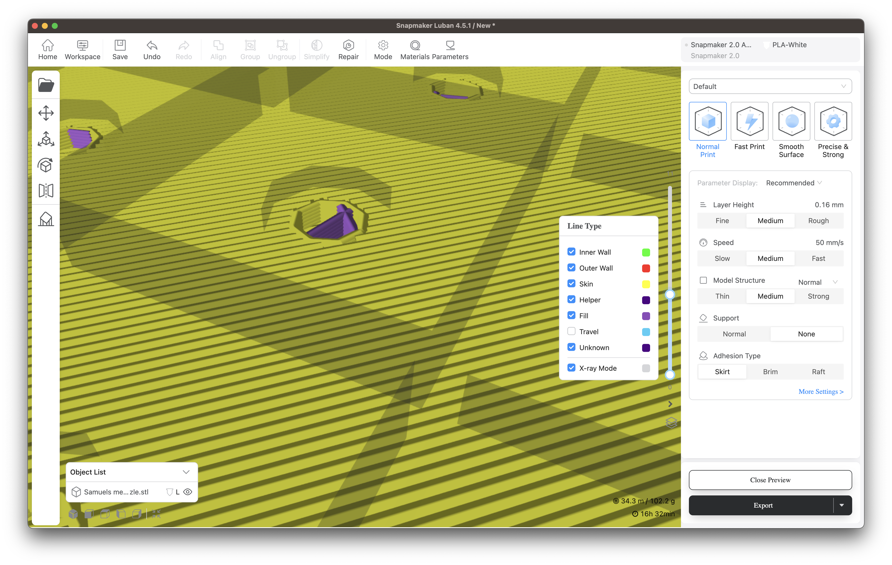
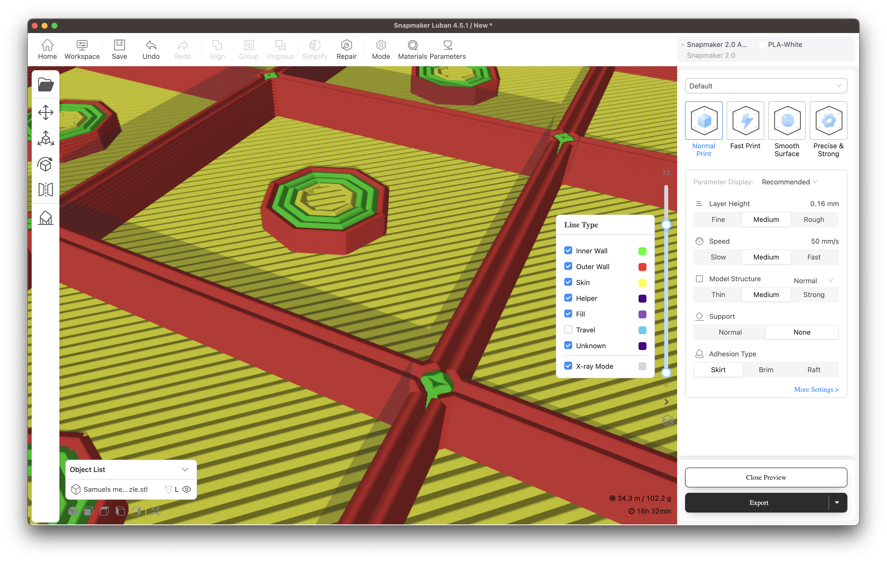
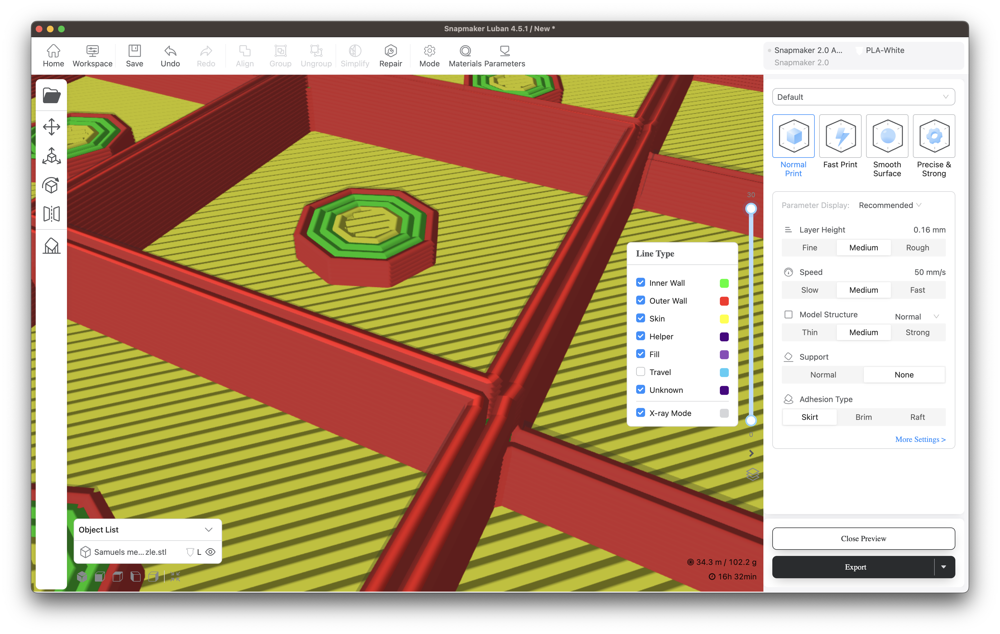

# crossword-generator-scad

_Work in progress..._

**TODOs:**

- [x] Modify ScadGenerator to read and modify the template based on the input CSV.
- [x] Modify the size of the output based on the size of the crossword provided.
- [x] Allow selection of mode.
- [x] Allow the cells to be modified in size, too.
- [ ] Print numbers into cells.

## Prerequisites

* [Docker](https://www.docker.com/products/docker-desktop/)

## Usage

Use `generate-crossword.sh` to convert a CSV file into a 3-dimensional crossword STL.

eg.

```shell
./generate-crossword.sh -i inputs/meta-crosstick-samuel-design.csv -p meta-puzzle -v templates/crossword-defaults.csv
```

### Activity

When running, this tool does the following:

1. Creates `working` and `results` directories.
2. Builds and runs a Docker image of ScadGenerator to generate a working SCAD file.
  * Inputs: `templates/crossword-template.scad` and the `--input-csv` file
  * Output: `working/crossword-working.scad`
3. Uses the [openscad/openscad](https://hub.docker.com/r/openscad/openscad) Docker image to generate the final STL.

## Inputs

Inputs to this tool are CSV-with-caveats. It's not a real CSV reader, so:

* Don't put commas in your strings.
* Don't nest inverted commas.

### Crossword CSV

You can use a CSV of any side. A grid of up to 11 x 9 characters will fit on a Snapmaker 250 series.

* [Copy the template sheet](https://docs.google.com/spreadsheets/d/1V18dAKi18F9mF3wuK5d-L5pdg0llTGk-J9Tq7vYNg_I/copy)
* Edit in your characters. Use lower case for regular letter spaces, and upper case for highlighted spaces.
* Export as CSV.

### Variable substitutions CSV

To alter variables that control the template, provide an alternative CSV file with the `-v` option. You can copy `templates/crossword-defaults.csv` to do this. It is a CSV file with no heading and 3 columns:

1. Variable name, eg. `MODE`
2. Value, eg. `0`
3. Human readable notes _(not used)_

## Filament changes

When printing a crossword, there are 3 distinct sections:

* The base
* The cells
* The highlights

To print these in different colours, you'll either need a multi-filament print head, or you'll need to change filament during the print. I'm afraid I don't know much about multi-filament printing.

To change filament during the print, you'll need to incorporate that instruction into the gcode that's sent to the printer. You may be able to do this automatically in your slicer. If not, as with Snapmaker Luban, then you'll need to do it manually by inserting an `M600` command in the right place.

### `M600` (change filament)

To change filament between layers for a multicoloured effect, you'll need an `M600` command.

* Identify the topmost printed layer of each section
* Export the gcode from your favourite slicer
* Insert an `M600` command at the end of the last layer of each section
* Print from your newly modified GCode directly

See:

* [Add command M600 in your GCode file](https://forum.snapmaker.com/t/add-command-m600-in-your-g-code-file/18242)
* [M600 Snapmaker gcode reference](https://snapmaker.github.io/Documentation/gcode/M600)

#### Identifying the layers (Luban)

When you've generated gcode, Luban offers an adjustable bar on the right, just by the 'line type' colour key, that shows all the layers.

You can pull it down from the top to hide layers and as you do so it shows an indicator with the number of the topmost layer that's visible. You can use it to see where each section of the print begins and ends, as here:

| Base | Cells | Highlights |
|-|-|-|
|  |  |  |
| Layers 0-11 | Layers 12-23 | Layers 24-30 |

Therefore to change filament between each section, you'd introduce an `M600` at the end of layer 11, and at the end of layer 23.

#### Example gcode

In this example, we introduce an `M600` command right before layer 24 in the gcode file. `...` indicates gcode commands before and after the area we're interested in:

```gcode
...
M600
;TIME_ELAPSED:2507.478646
;LAYER:24
...
```

As you can see, the layer beginnings are numbered quite clearly, and begin with the prefix: `;LAYER:` - this makes it easy to search through large gcode files for the right place to insert your `M600`.

#### Printing your altered gcode

Now that you've modified the gcode, you'll need to send it to your printer. Snapmakers will need you to _send_ the file to the printer, and then print it from there using the control panel, rather than initiate a print from Luban.
